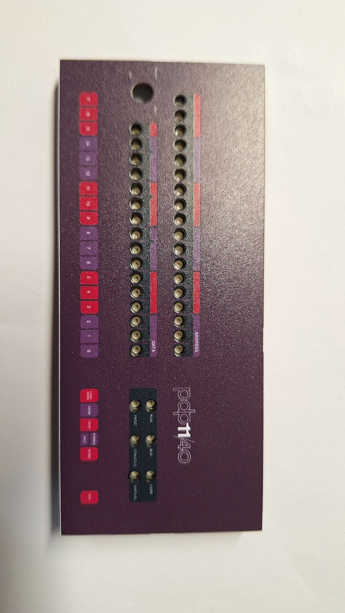
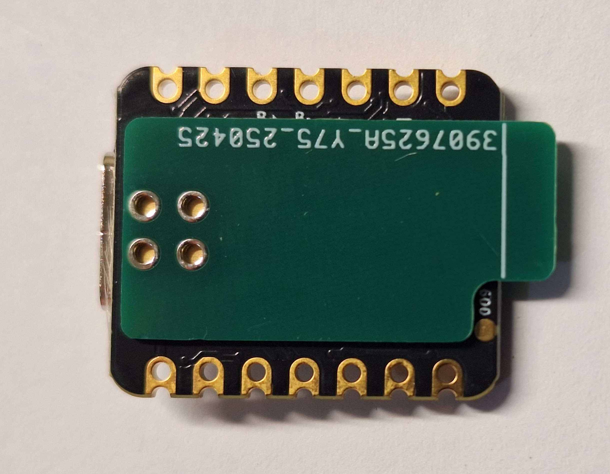

# PDP-11/40 Mini Panel (Unfinished)

Included in this repository are the PCB files to make a miniature PDP-11/40 front panel. The board uses a XIAO nrf52840 dev board. No software has been written yet.

# Ordering pcbs
This project consists of three pcbs:
- A faceplate - Decorative only
    - pdp-11-colour.zip
    - 2 layers
    - PCB Color: White
    - Silkscreen Technology: EasyEDA multi-color silkscreen
- Main PCB - Has all electronics
    - pdp-11-pcb.zip
    - 4 layers
- Spacer PCB (Optional) - Removes the need for hot air
    - XIAO-nRF52840-spacer_thin.zip
    - 2 layers
    - Thickness: 0.8m
    - Deburring/Edge rounding: No

# Building
Place the spacer on the back of the nrf52840 module with the pads facing the the front. Solder the spacer to the back of the module using a minimal amount of solder. File the solder pints flat if needed.

Solder the module and spacer to the main PCB. Using some short wire solder the pads of the space to the main PCB. Skip the top most pad, its ground.

For the programming header orientation check [main pcb image](/images/pcb_back.jpg).

# Programming
¯\\_(ツ)_/¯

# BOM

| Quantity | Part                | Link                                                                                            |
|----------|---------------------|-------------------------------------------------------------------------------------------------|
| 1        | mini nrf52840       | https://www.aliexpress.com/item/1005008563470913.html                                           |
| 1        | 3.3V 1A SOT-223 Reg | https://www.digikey.co.nz/en/products/detail/texas-instruments/TLV1117LV33DCYR/2666508          |
| 40       | Red LED LSP47K      | https://www.digikey.co.nz/en/products/detail/ams-osram-usa-inc/LS-P47K-H1K2-1-0-2-R18-Z/1227985 |
| 2        | 1uf 0805            | https://www.digikey.co.nz/en/products/detail/samsung-electro-mechanics/CL21B105KAFNNNE/3886724  |
| 5        | 74HC595PW           | https://www.digikey.co.nz/en/products/detail/nexperia-usa-inc/74HC595PW-118/946653              |
| 40       | 150R 0805           | https://www.digikey.co.nz/en/products/detail/yageo/RC0805JR-07150RL/728255                      |
| 2        | 100R 0805           | https://www.digikey.co.nz/en/products/detail/yageo/RC0805JR-10100RL/14286702                    |
| 1        | Programming Header  | https://www.digikey.co.nz/en/products/detail/adafruit-industries-llc/4048/9843412               |
| 1        | Expansion Header    | https://www.digikey.co.nz/en/products/detail/adam-tech/HRS-2C-16-G-SMT-P/10245144               |